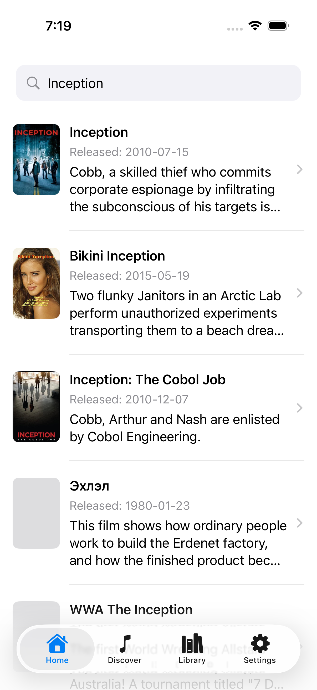
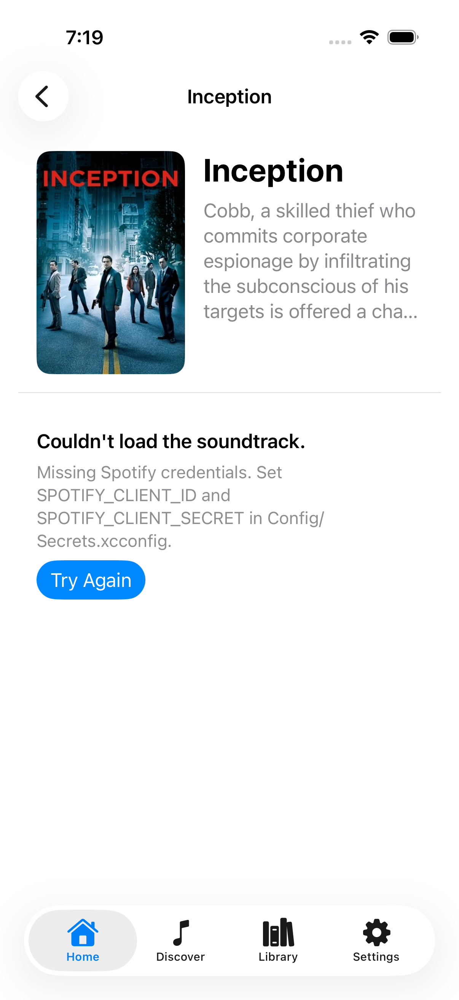
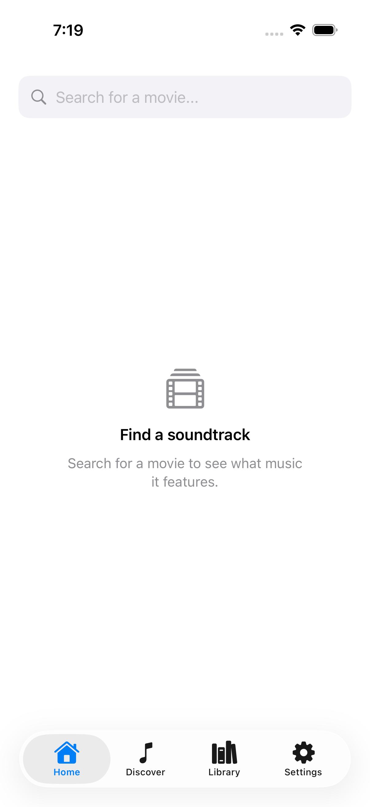
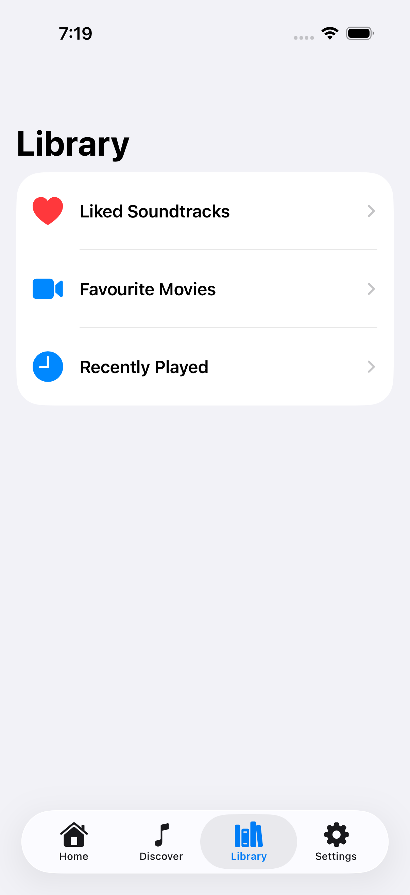
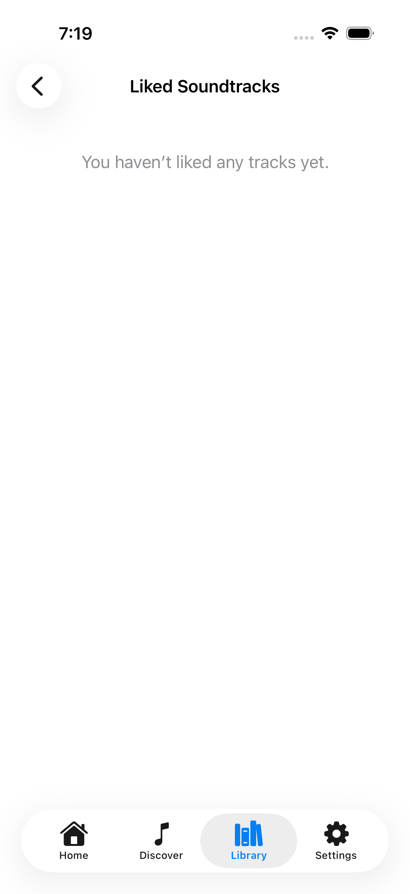
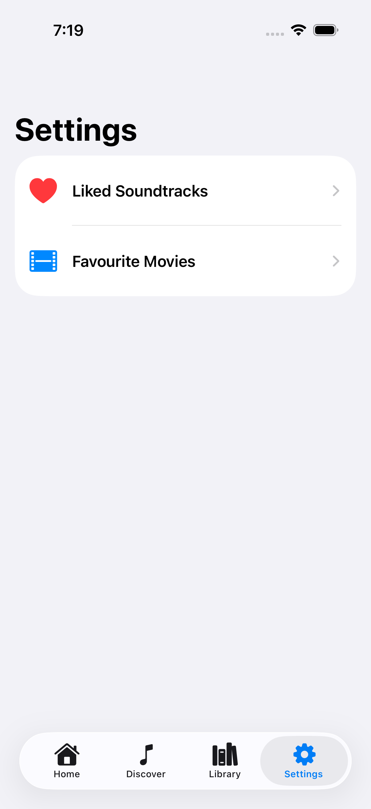
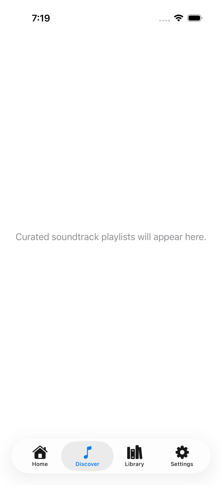

# CineTunes

> **Archived project.** This is an early iOS app I built to learn SwiftUI and
> working with third-party APIs. It is no longer maintained and is kept here for
> reference.
>
> My current work lives at **[TODO: link to your current project]**.
>
> Originally built as part of the Develop the Future Co-op final showcase.

CineTunes answers a small question: *what music is in this movie?* Search for a
film, see its soundtrack, and open the tracks in Spotify.

## Why this was archived

**Spotify changed its developer policy in February 2026.** Development Mode apps
now require the app owner to hold an active **Spotify Premium** subscription, and
test users are capped at five ([announcement](https://developer.spotify.com/blog/2026-02-06-update-on-developer-access-and-platform-security),
[migration guide](https://developer.spotify.com/documentation/web-api/tutorials/february-2026-migration-guide)).

That was the end of this project. The entire premise was reading a film's
soundtrack out of Spotify, and paying for a Premium subscription to keep a
learning project alive wasn't worth it.

The app still works end to end against TMDB — only the Spotify half is now gated
behind a subscription, which is why the screenshots below stop at "Missing
Spotify credentials".

## What it does

1. **Search a movie** — queries the [TMDB](https://www.themoviedb.org/) API and
   lists matching films with poster, release date, and plot summary.
2. **Find the soundtrack** — looks the film up on Spotify and lists the tracks
   from the best-matching album.
3. **Open or save** — tap the Spotify icon on a track to open it in the app, or
   tap the heart to add it to your liked soundtracks.

The search screen handles all four states explicitly: an initial prompt before
searching, a spinner while loading, a "no results" message naming the query, and
an error view with a **Try Again** button.

## Screens

| Screen | State |
| --- | --- |
| Search (Home tab) | Working |
| Soundtrack detail | Working, but needs Premium Spotify credentials |
| Liked Soundtracks | Working |
| Library / Settings | Working (navigation only) |
| Discover | Placeholder — never built |
| Favourite Movies | Placeholder — never built |
| Recently Played | Placeholder — never built |

The three placeholders are still reachable from the Discover tab and from rows
in Library, and show "Coming Soon" text.

## Known limitations

These are the rough edges I'd fix first if I picked this up again:

- **Favourites are not persisted.** `FavouritesManager` holds them in memory
  only, so everything resets when the app relaunches. There's no `UserDefaults`
  or file backing.
- **Spotify auth isn't production-appropriate.** It uses the client-credentials
  flow, which is designed for server-to-server apps. Using it in a shipped
  client means the client secret sits in the app bundle where it can be
  extracted. The correct approach is Authorization Code + PKCE, or proxying
  Spotify through a backend. (Moot now that API access requires Premium — see
  [Why this was archived](#why-this-was-archived).)
- **The Spotify token never refreshes.** It expires after about an hour, after
  which requests fail until the app is restarted.
- **Album tracks are parsed with `JSONSerialization`** rather than `Codable`, so
  a schema change silently yields an empty list instead of an error.
- **The movie title search uses `originalTitle`** rather than the localised
  `title`, which makes non-English films search poorly on Spotify.
- **No tests and no CI.** Everything was verified by running the app by hand.
- **The app icon is upscaled** from a smaller logo rather than being real
  1024×1024 artwork.

## Running it

Requires Xcode and an iOS 17.5+ simulator or device. The app targets both iPhone
and iPad.

```bash
git clone [TODO: repo URL]
cd CineTunes
open CineTunes.xcodeproj
```

Credentials are deliberately **not** in source control. Copy the template and
fill in your own:

```bash
cp Config/Secrets.example.xcconfig Config/Secrets.xcconfig
```

Then set:

- `TMDB_API_KEY` — the TMDB **read access token** from your
  [TMDB API settings](https://www.themoviedb.org/settings/api)
- `SPOTIFY_CLIENT_ID` and `SPOTIFY_CLIENT_SECRET` — from the
  [Spotify Developer Dashboard](https://developer.spotify.com/dashboard). Be
  aware that Spotify now requires the app owner to hold a **Premium**
  subscription for Development Mode apps, so this step may not be open to you.

With only `TMDB_API_KEY` set, movie search works fully and the soundtrack screen
reports the missing Spotify credentials instead of failing silently.

`Config/Secrets.xcconfig` is git-ignored. The project still **builds** without
it — the features that need credentials report a missing-configuration error
instead of failing silently, because `Shared.xcconfig` includes the secrets file
optionally (`#include?`).

## How it's put together

```
CineTunes/
├── CineTunes/          SwiftUI views, app entry point, asset catalog
├── Models/             Data models, API services, favourites store, secrets reader
├── Config/             xcconfig files; credentials injected at build time
└── CineTunes.xcodeproj
```

Credentials flow from `Secrets.xcconfig` → build settings → generated
`Info.plist` keys → the `AppSecrets` reader, so no API key is ever written into
a Swift file.

- **SwiftUI**, iOS 17.5+, iPhone and iPad
- **async/await** throughout; `SpotifyService` is an `actor`, so its cached token
  is safe across concurrent calls
- **URLSession + Codable** with typed errors that surface in the UI rather than
  being swallowed
- **State** via `FavouritesManager`, an `ObservableObject` injected through the
  SwiftUI environment
- Networking is split from the views: `MovieService` (TMDB) and `SpotifyService`
  (Spotify), both consumed from `@MainActor` view code

## Screenshots

Searching for a film returns real results from TMDB:

<p align="center">
  
</p>

Opening one shows the film's details and plot, then stops at the Spotify
credential wall — which is where this project ended:

<p align="center">
  
</p>

The rest is navigation plus the three screens that were never built:

<p align="center">
  
  
  
  
  
</p>

---

Built by **Joel Joseph**.
